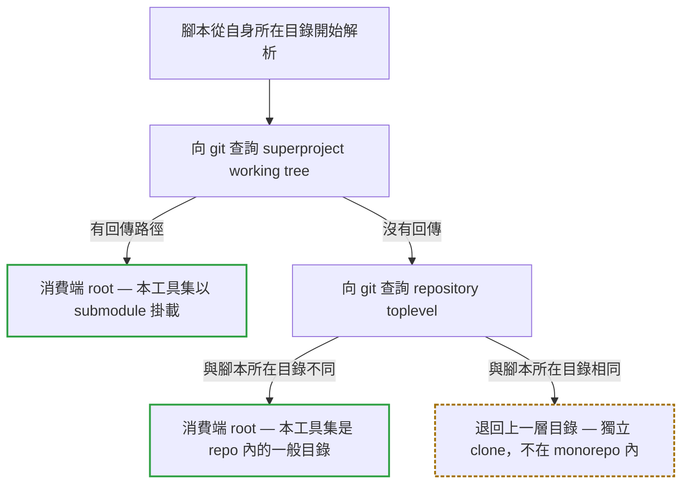
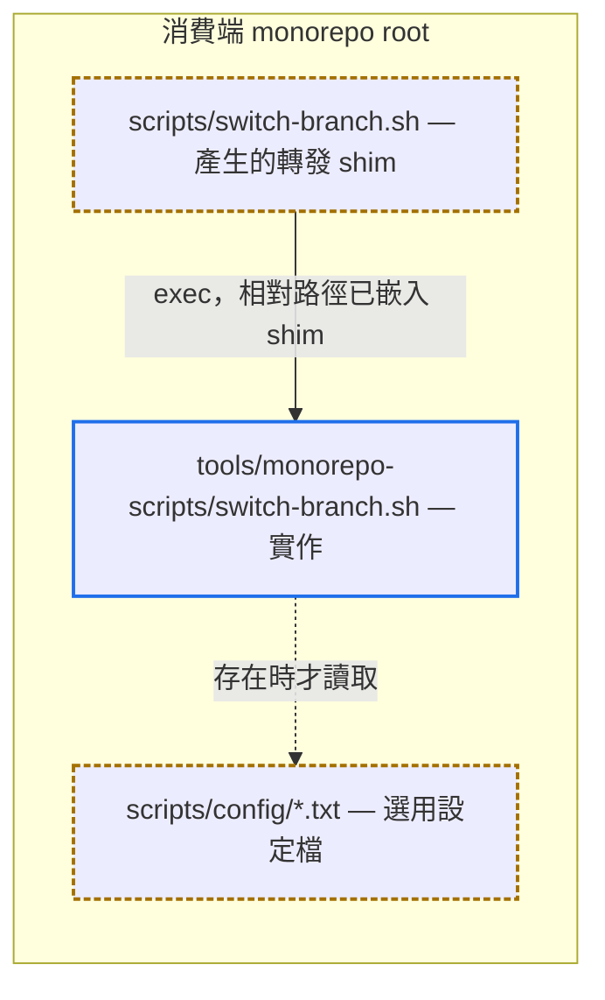

# monorepo-scripts

供任何 Git Submodule monorepo 掛載使用的分支控制工具集，不綁定任何特定 repo。

<a id="quick-nav"></a>

## 快速導覽

- [簡介](#overview)
- [掛載與解析機制](#resolution)
- [安裝慣例](#install)
- [腳本清單](#scripts)
- [消費端耦合面](#coupling)
- [安全行為](#safety)
- [Config 慣例](#config)
- [消費端腳本範例](#sample)
- [備註](#notes)

<a id="overview"></a>

## 簡介

`monorepo-scripts` 涵蓋分支切換、合併、刪除、更新、推送、遠端同步清點，以及 root gitlink fast-path commit。

工具集本身不含任何專案專屬內容：

- 不內建 submodule 清單，一律從消費端的 `.gitmodules` 動態列舉。
- 不依賴 Python 或任何專案專屬套件。`.sh` 版另需標準 Unix 工具（`sed`、`grep`、`awk`、`sort`、`cut`、`tr`、`dirname`、`basename`、`mktemp`），在 Git Bash / Linux / macOS 皆已內建。
- 不內建合併方向規則、repo 縮寫或 remote 名稱，全部由消費端的 [scripts/config/](#config) 提供，未提供時採用通用預設值。

[返回開頭](#quick-nav)

---

<a id="resolution"></a>

## 掛載與解析機制

腳本必須先找出「消費端 repo root」才能操作 submodule。root **不是**用腳本位置的上一層硬推，而是交給 git 判定，因此掛載深度不受限制：



落到 fallback 時，代表工具集不在任何 monorepo 之內；此時分支腳本會印出「找不到 submodule」並附上解析到的 root 路徑，供判斷掛載位置是否正確。

[link-scripts](link-scripts.sh) 產生的轉發 shim 會把「從 `scripts/` 走到工具集」的相對路徑寫死在 shim 內，掛在 `tools/monorepo-scripts` 這種較深的位置一樣可用：



[返回開頭](#quick-nav)

---

<a id="install"></a>

## 安裝慣例

以 submodule 掛載到消費端 repo 底下的任一位置：

```bash
git submodule add <this-repo-url> monorepo-scripts
# 或掛深一層
git submodule add <this-repo-url> tools/monorepo-scripts
```

掛載後在消費端 repo 執行一次 [link-scripts](link-scripts.sh)，把轉發 shim 產生到消費端的 `scripts/`：

```bash
# Windows
.\monorepo-scripts\link-scripts.ps1
# Unix/macOS
./monorepo-scripts/link-scripts.sh
```

`scripts/` 不存在時會自動建立。產生的 shim 會 commit 進消費端 repo，其他人 clone 後即已具備；只有當工具集增刪工具時才需重跑 `link-scripts` 同步，詳見[備註](#notes)。

新開 monorepo 時改跑 [init-scripts](init-scripts.sh)：它會先呼叫 `link-scripts` 產生 shim，再把 [sample/](sample/SAMPLE.md) 的消費端自有腳本（`rollback`、`normalize-git-eol`）一併複製進 `scripts/`，一步備妥整個目錄。已有 `scripts/` 的既有 repo 仍只跑 `link-scripts`。

以 `delete-branch` 為例，產生出來的內容長這樣（掛載於 root 的 `monorepo-scripts/` 時）：

```bash
# scripts/delete-branch.sh
#!/usr/bin/env bash
# AUTO-GENERATED by monorepo-scripts/link-scripts; do not edit, re-run the generator.
exec bash "$(dirname "${BASH_SOURCE[0]}")/../monorepo-scripts/delete-branch.sh" "$@"
```

```powershell
# scripts/delete-branch.ps1
# AUTO-GENERATED by monorepo-scripts/link-scripts; do not edit, re-run the generator.
$t = Join-Path $PSScriptRoot "..\monorepo-scripts\delete-branch.ps1"
if (-not (Test-Path $t)) { Write-Error "linked target missing: $t"; exit 1 }
& $t @args
exit $LASTEXITCODE
```

上面那段相對路徑是 `link-scripts` 依實際掛載位置算出來後寫死的，掛在 `tools/monorepo-scripts` 就會變成 `..\tools\monorepo-scripts\`。因此 shim **只能由產生器產出，不可手抄或跨 repo 複製**；`link-scripts` 另外會以 `git update-index --add --chmod=+x` 把 `.sh` 標記為可執行，手動複製也拿不到這一步。

**執行環境需求**：

- **Git 2.22 以上**。腳本大量使用 `git branch --show-current`（Git 2.22 起）與 `%(refname:strip=N)`。太舊的 git 不會整支失敗，而是讓個別指令回空值、分支清單靜默變空，因此 [lib/repo-context.sh](lib/repo-context.sh) 與 [lib/repo-context.ps1](lib/repo-context.ps1) 會在啟動時檢查版本並中止。
- **Bash 4.2 以上**。多支腳本使用 associative array 與 `mapfile`；[lib/repo-context.sh](lib/repo-context.sh) 是所有 `.sh` 腳本共同的入口，會提前檢查版本，不足時印出明確錯誤並中止。macOS 內建的 `/bin/bash` 長年停留在 3.2，必須另外安裝較新版 bash 並確保其在 `PATH` 中排在系統版本之前。
- **行尾一律 LF**。[.gitattributes](.gitattributes) 已強制 `eol=lf`；`.sh` 若帶 CRLF，在 Linux/macOS 會直接 `bad interpreter`。

[返回開頭](#quick-nav)

---

<a id="scripts"></a>

## 腳本清單

本工具集根目錄的每個工具都有成對的 `.ps1` 與 `.sh`，行為一致；[sample/](sample/SAMPLE.md) 的消費端範例不受此規範。

| 腳本 | 用途 |
|------|------|
| [switch-branch](switch-branch.sh) | 一次切換 root 與所有 submodule 到相同分支 |
| [merge-branch](merge-branch.sh) | 合併分支，並在 root 只剩 submodule ref 漂移時自動 commit |
| [delete-branch](delete-branch.sh) | 刪除本地／遠端分支；互動式多選會保護 `main`/`master`/`develop` 與當前分支，快速清除模式改以「是否已完整推送」逐分支把關 |
| [update-branch](update-branch.sh) | Fetch/pull 更新分支，含 detached-HEAD 自動判斷與 pull-all 模式 |
| [push-branch](push-branch.sh) | 推送變更到遠端 |
| [sync-remote-branches](sync-remote-branches.sh) | 清點各 repo 的 remote branch 同步狀態 |
| [root-fastpath-commit](root-fastpath-commit.sh) | root 只有 submodule ref 漂移時，一鍵 commit + push |
| [link-scripts](link-scripts.sh) | 在消費端的 `scripts/` 產生／更新轉發 shim |
| [init-scripts](init-scripts.sh) | 新開 monorepo 用：跑 `link-scripts` 產生 shim，再把 [sample/](sample/SAMPLE.md) 的消費端自有腳本複製進 `scripts/` |

[返回開頭](#quick-nav)

---

<a id="coupling"></a>

## 消費端耦合面

工具集對消費端環境的全部要求如下。「硬」代表不滿足時該腳本會中止，「軟」代表有可用的預設行為。

| 耦合 | 硬／軟 | 影響範圍 | 不滿足時的行為 |
|---|---|---|---|
| `.gitmodules` 存在且至少一個 submodule | 硬 | 全部分支腳本 | 印出錯誤與解析到的 root 路徑後 `exit 1` |
| submodule 已 `git submodule update --init` | 軟 | 分支腳本 | 未初始化者印出「略過」訊息後排除，不對它執行任何 `git -C` 操作；全部都未初始化時等同「找不到 submodule」而中止。詳見[備註](#notes) |
| submodule 已 `git submodule update --init` | 硬 | 僅 `root-fastpath-commit` | 未初始化**且 gitlink 有變更**時印出錯誤後 `exit 1`，root 絕不 push。無法驗證該 gitlink 是否已發佈，等同不可推送 |
| 各 repo 都有同名的 git remote | 硬 | 全部涉及遠端的操作 | 預設 `origin`；名稱不同時必須設定 [remote.txt](#config)，否則該 remote 的分支完全不會被列舉：本地也有同名分支的會顯示成「只有本地」，只存在於遠端的則整個不出現 |
| Git 2.22 以上 | 硬 | 全部 | 啟動時檢查 `git --version`，不足或取不到版本即印出錯誤後中止 |
| Bash 4.2 以上 | 硬 | 全部 `.sh` | [lib/repo-context.sh](lib/repo-context.sh) 印出版本錯誤後中止 |
| 消費端有 `scripts/` 目錄 | 軟 | 僅 `link-scripts` / `init-scripts` | 不存在時自動建立 |
| 工具集位於消費端 repo 之內 | 軟 | 分支腳本 | 由 git 判定，掛載深度不限；完全在 repo 外時退回上一層目錄，再由「找不到 submodule」錯誤帶出解析路徑 |
| 工具集位於消費端 repo 之內 | 硬 | 僅 `link-scripts` / `init-scripts` | 無法算出相對路徑就無法產生正確 shim，印出 root 與工具集位置後 `exit 1` |
| [scripts/config/](#config) 的設定檔 | 軟 | 對應腳本 | 採用各自的預設值 |

[返回開頭](#quick-nav)

---

<a id="safety"></a>

## 安全行為

這些工具會直接操作 git（commit / push / fetch / checkout）。使用前先看這張表，**嚴禁對著腳本傳未經確認的旗標（例如猜測性的 `--help`、`--dry-run`）去試探用法**：除表中標示會吃參數者外，其餘腳本不解析任何 CLI 參數，旗標會被忽略、照樣執行完整流程，不會印用法說明也不會中止。

| 腳本 | 吃 CLI 參數？ | 執行前二次確認？ | 備註 |
|---|---|---|---|
| `switch-branch` | 是（位置參數：分支名稱） | 否，帶參數即進非互動模式直接切換 | 不帶參數則進互動選單 |
| `update-branch` | 是（位置參數：`pull` / `fetch` / `pull-all`） | 否 | 不帶參數進互動選單；不合法的值會被拒絕並中止 |
| `merge-branch` | 否 | 是（互動 `y/N` 確認） | 合併方向另受 [merge-direction-rules.txt](#config) 白名單/黑名單限制 |
| `delete-branch` | 否 | 是（互動多選 + `y/N` 確認）；快速清除模式除外 | 快速清除模式的安全網是逐分支確認「已完整推送」，非互動確認 |
| `push-branch` | 否 | 否 | 一律直接 push |
| `root-fastpath-commit` | 否 | 否 | 條件符合（root 只有 submodule ref 漂移）就直接 commit + push，沒有 dry-run |
| `sync-remote-branches` | 否 | 是（清點後另問是否推送：全部推送／逐筆確認／取消） | 清點階段唯讀；選擇推送才會 `git push -u` 補齊缺失的遠端分支 |
| `link-scripts` | 否 | 否 | 產生／更新 shim，並以 `git update-index --add --chmod=+x` 把 `.sh` 標記為可執行（會改動消費端 index） |
| `init-scripts` | 否 | 否 | 先驗後寫：任一自有腳本在 `scripts/` 已存在就整批中止，不覆蓋。中止時 `link-scripts` 尚未執行，`scripts/` 維持原狀 |

想知道某支腳本的實際行為，順序是：先看這張表 → 還不夠再讀腳本開頭的參數解析區塊，**嚴禁**用猜測的旗標去執行它。

[返回開頭](#quick-nav)

---

<a id="config"></a>

## Config 慣例

只讀消費端 repo 的 `scripts/config/`：

| 設定檔 | 用途 | 格式 | 找不到時的行為 |
|---|---|---|---|
| `remote.txt` | 各 repo 使用的 git remote 名稱 | 第一個非註解行即名稱，只允許 `A-Z a-z 0-9 . _ -` | 使用 `origin` |
| `repo-aliases.txt` | 各腳本顯示用的短名稱對照 | 每行 `<repo-path> <alias>` | fallback 成 repo 路徑最後一個 `-` 分段 |
| `merge-direction-rules.txt` | `merge-branch` 的合併方向白名單/黑名單 | 每行 `<repo> allow\|deny <source-branch> <target-branch>...` | 視為無限制、允許所有合併 |

三個檔案都以 `#` 開頭為註解。`remote.txt` 含不合法字元時，腳本會印出錯誤並中止，不會退回 `origin`。

[返回開頭](#quick-nav)

---

<a id="sample"></a>

## 消費端腳本範例

[sample/](sample/SAMPLE.md) 是一個消費端 `scripts/` 目錄的完整範例，假設工具集掛在消費端 root 的
`monorepo-scripts/`。新開 monorepo 時執行 [init-scripts](init-scripts.sh) 即可備妥 `scripts/`，不需手動複製。

| 內容 | 說明 |
|------|------|
| 7 組轉發 shim | 與 [link-scripts](link-scripts.sh) 的產出逐位元相同，預先產生好的快照 |
| [rollback](sample/rollback.sh)（跨平台） | 消費端自有腳本：一次取消 root 與所有 submodule 的本地變更 |
| [normalize-git-eol](sample/normalize-git-eol.ps1)（Windows） | 消費端自有腳本：對齊 root 與所有 submodule 的換行設定；只有 `.ps1` 是因為 CRLF 寫進 index 只發生在 Windows，但它的 `--renormalize` 在任何平台都會改動 index |

自有腳本同樣不綁定任何特定 repo，外部相依只有 `git` 與 `dirname`，不屬於本工具集的功能，
[link-scripts](link-scripts.sh) 也不會為它們產生 shim。

shim 的相對路徑寫死在檔案內，因此改變掛載位置後必須重跑 `link-scripts` 覆寫；工具集增刪工具時，
`sample/` 的 shim 也要一併更新（消費端則重跑 `link-scripts` 即可）。

**`sample/` 的 shim 只在工具集掛於 root 下一層時正確**，因此 [init-scripts](init-scripts.sh) 不複製它們，
改由 `link-scripts` 依實際掛載位置產生；它只複製 `link-scripts` 產不出來的自有腳本。

[返回開頭](#quick-nav)

---

<a id="notes"></a>

## 備註

- `root-fastpath-commit` 的 push 順序簡化為兩層（submodule 任意順序 → root 最後），不做完整拓撲排序；若消費端的下游 repo 依賴嚴格的 push 順序，必須自行擴充。
- `lib/` 內的共用函式依各自職責以參數接收 script dir、repo root、`.gitmodules` 路徑或 submodule 路徑，沒有任何函式從自身檔案位置推導 repo root。唯一的相對路徑推導是 `resolve_repo_root` / `Get-ConsumerRepoRoot` 的獨立-clone fallback（退回上一層），該情形已在函式內註解說明。
- **未初始化的 submodule 一律排除，不是為了方便，而是為了安全。** `.gitmodules` 有登記但尚未 `git submodule update --init` 的 submodule 在檔案系統上只是一個空目錄，`git -C <該目錄>` 會沿目錄往上找到 superproject，於是 `git -C lib/x branch -D b` 刪掉的是 **root 的分支**、`git -C lib/x checkout b` 切換的是 **root 的 HEAD**、`git -C lib/x fetch` 抓進的是 **root**。因此 [lib/repo-context.sh](lib/repo-context.sh) 的 `list_initialized_submodule_paths` 與 [lib/repo-context.ps1](lib/repo-context.ps1) 的 `Get-InitializedSubmodulePaths` 會先以 `rev-parse --show-toplevel` 確認每個路徑是「它自己的」worktree root，不通過就排除並印出略過訊息。所有腳本一律經由這兩支函式取得 submodule 清單，**嚴禁**直接用 `list_submodule_paths` / `Get-SubmodulePaths` 的結果去做 `git -C` 操作。
- **但 `root-fastpath-commit` 的 gitlink 驗證必須用未過濾的完整清單。** root 一旦 push，它 tree 裡記錄的每一個 gitlink 都會被發佈，與該 submodule 在本機是否已初始化無關；只驗證已初始化的那些，會讓未初始化者的 gitlink 靜默上遠端，新 clone 因此指向一個從未發佈的 commit。取 gitlink 只對 root 做 `ls-tree`，用完整清單是安全的；真正無法做的是「驗證該 SHA 是否可從遠端觸及」（`branch -r --contains` 會落到 root），因此該情況一律硬中止而非略過。
- `root-fastpath` 讀 `git status --porcelain` 一律加 `-z`。不加 `-z` 時 git 會把含空白的路徑輸出成 `"lib/real dep"`，而 `.gitmodules` 取到的是不帶引號的 `lib/real dep`，兩者永遠比不中，含空白路徑的 submodule 會被誤判成「非 submodule 檔案」而使 fast-path 永遠不可用（`core.quotePath=false` 無效，它只影響非 ASCII）。`-z` 下 rename/copy 會多輸出一個「原路徑」欄位，必須額外跳過。
- `link-scripts` 產生的 shim 是**需重跑才更新的快照**，不是活連結；工具集新增或移除工具後，必須重跑 `link-scripts` 並在消費端 repo 重新 commit。
- `link-scripts` 的 stale 偵測（shim 存在但來源腳本已消失）僅**報告**，不自動刪除，必須由開發者以 `git diff` 審查後自行處理。
- 執行 `link-scripts` 或 `init-scripts` 前必須先在消費端 repo 執行 `git submodule update --init`，確保工具集內容已存在。
- `init-scripts` 不寫死檔名清單，改用兩道規則挑出要複製的檔案：副檔名須是 `.sh` 或 `.ps1`（白名單，`.md` 等一律不取），且檔頭前兩行不得含 `AUTO-GENERATED` marker（帶 marker 者是 shim，交給 `link-scripts` 產生）。`sample/` 日後增減自有腳本時 `init-scripts` 不必跟著改。marker 只認前兩行，自有腳本在註解中提到這段文字不會被誤判；副檔名與 marker 的比對在 `.sh` / `.ps1` 兩版都分大小寫，避免 `NOTES.MD` 這類檔名只被其中一版擋下。
- `link-scripts` 不為 `link-scripts` 與 `init-scripts` 自己產生 shim：兩者都是工具集側的產生器／啟動器，必須從工具集目錄直接執行，不是消費端入口。
- `delete-branch` 的快速清除模式要求 root 與所有 submodule 目前分支完全一致才會執行；且不比照互動式多選保護 `main`/`master`/`develop`，安全網只有「逐分支確認已完整推送到遠端」。
- 分支清點一律只列舉 `refs/remotes/<remote>/` 底下的 ref，不使用 `git branch -r`（那會把其他 remote 的分支一併當成分支名）。唯一例外是 `root-fastpath-commit` 的可達性驗證，它用 `git branch -r --contains` 查出所有 remote 後，再以前綴篩出設定的 remote。因此同一個 monorepo 內的 root 與所有 submodule 必須使用相同的 remote 名稱；額外的 remote 可以存在，但不會被清點。

[返回開頭](#quick-nav)
